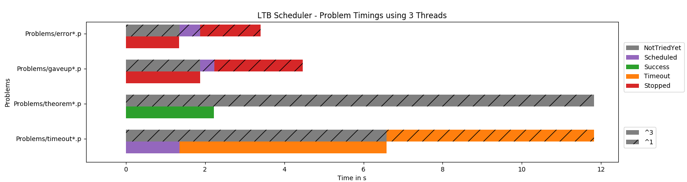

# LTB support for Leo-III
An LTB support for the automated theorem prover Leo-III.

## 
The CADE ATP System Competition (CASC) is hosting a [LTB division](http://tptp.org/CASC/27/Design.html#Divisions). This project
aims to implement a solution for the LTB division using [Leo-III](http://page.mi.fu-berlin.de/lex/leo3/).

## Requirements
* python >= 3.5
* leo3

## Getting started
```
[leo3ltb]$ cd example4
[example1]$ ./run_ltb
```

View the logs:
```
[example1]$ cat Log~/batch.log
```

Get all problem variant outputs:
```
[example1]$ cd Log~
```

Get final outputs:
```
[example1]$ cd Output~
```

And a Scheduler runtime profile in ```Log~/profile.png```:


## License
leo3ltb is licensed under the BSD 3-clause "New" or "Revised" License. See [LICENSE](LICENSE).

## Docs
The documentation consits of 
* an [autogenerated documentation](/docs/index.md)
* some examples
    - [example1](/example1)
    - [example2](/example2)
    - [example3](/example3)
    - [example4](/example4)

## Build docs
```
$ cd docs
$ python3 -m pip install pydoc-markdown --user
$ pydocmd build
```

Start doc html server:
```
$ pydocmd serve
```
